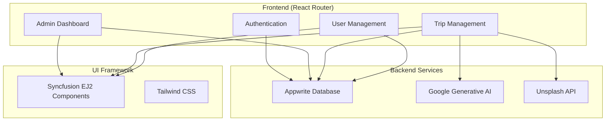

# Travello - AI-Powered Travel Agency Dashboard

A modern, full-stack travel agency application built with React Router that combines AI-powered trip generation with comprehensive administrative capabilities. [1](#0-0) 

## 🚀 Features

### Admin Dashboard
- **Real-time Analytics**: User growth metrics, trip statistics, and data visualization [2](#0-1) 
- **User Management**: Complete admin interface for managing user accounts [3](#0-2) 
- **Trip Management**: Create, view, and manage AI-generated travel itineraries [4](#0-3) 
- **Role-based Access Control**: Secure admin-only access with authentication [5](#0-4) 

### AI-Powered Trip Generation
- **Google Generative AI Integration**: Intelligent travel itinerary creation [6](#0-5) 
- **Dynamic Image Integration**: Automatic travel destination images via Unsplash API [7](#0-6) 
- **Interactive Maps**: Geographic visualization using Syncfusion Maps [8](#0-7) 

## 🛠️ Tech Stack

### Frontend
- **React Router 7.7.1** - Modern full-stack React framework [9](#0-8) 
- **React 19.1.0** - Latest React with concurrent features [10](#0-9) 
- **TypeScript** - Type-safe development [11](#0-10) 
- **Tailwind CSS 4.1.4** - Utility-first styling [12](#0-11) 

### Backend & Services
- **Appwrite 18.2.0** - Backend-as-a-Service for auth, database, and storage [13](#0-12) 
- **Google Generative AI** - AI-powered trip generation [6](#0-5) 

### UI Components
- **Syncfusion EJ2** - Professional UI components for charts, grids, and navigation [14](#0-13) 

### Monitoring
- **Sentry** - Error tracking and performance monitoring [15](#0-14) 

## 🏗️ Architecture



## 🚦 Getting Started

### Prerequisites
- Node.js 20+ 
- npm or yarn
- Appwrite account and project setup
- Google AI API key
- Unsplash API key

### Installation

1. **Clone the repository**
   ```bash
   git clone https://github.com/mohamedabdelstar06/Travel-Agency.git
   cd Travel-Agency
   ```

2. **Install dependencies**
   ```bash
   npm install
   ``` [16](#0-15) 

3. **Environment Setup**
   Create a `.env` file with your API keys:
   ```env
   GOOGLE_AI_API_KEY=your_google_ai_key
   UNSPLASH_ACCESS_KEY=your_unsplash_key
   APPWRITE_PROJECT_ID=your_appwrite_project_id
   APPWRITE_DATABASE_ID=your_database_id
   ```

4. **Start development server**
   ```bash
   npm run dev
   ``` [17](#0-16) 

## 📦 Build & Deployment

### Production Build
```bash
npm run build
``` [1](#1-0) 

### Development Server
```bash
npm run dev
``` [2](#1-1) 

### Production Server
```bash
npm start
``` [3](#1-2) 

### Docker Deployment
```bash
# Build the Docker image
docker build -t tourvisto .

# Run the container
docker run -p 3000:3000 tourvisto
``` [4](#1-3) 

### Supported Deployment Platforms
The containerized application can be deployed to any platform that supports Docker, including:

- AWS ECS
- Google Cloud Run  
- Azure Container Apps
- Digital Ocean App Platform
- Fly.io
- Railway [5](#1-4) 

### DIY Deployment
If you're familiar with deploying Node applications, the built-in app server is production-ready.

Make sure to deploy the output of `npm run build`:

```
├── package.json
├── package-lock.json
├── build/
│   ├── client/    # Static assets
│   └── server/    # Server-side code
``` [6](#1-5) 
